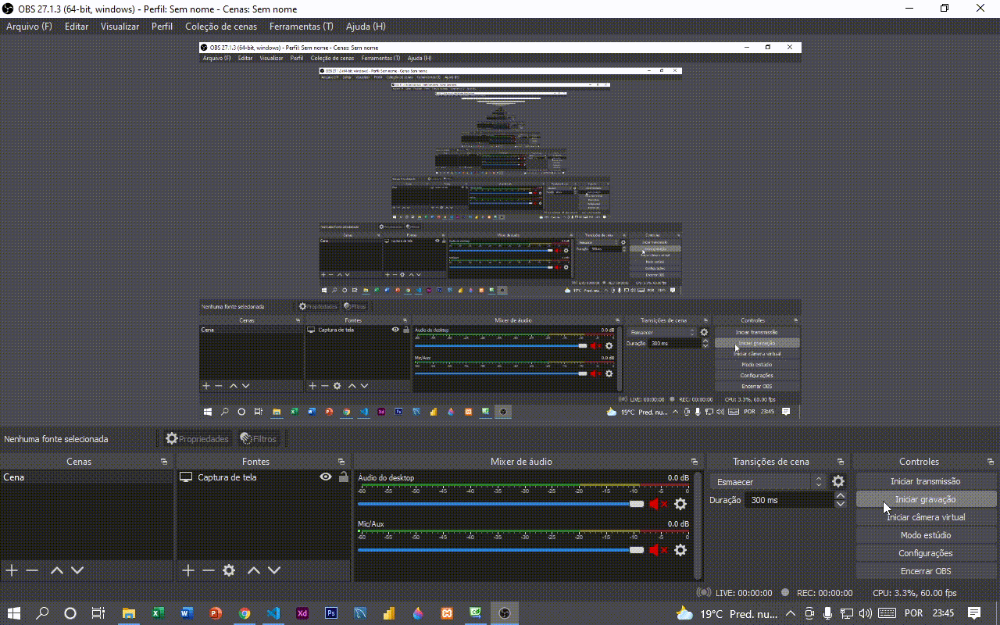

# Cálculo da média das notas

Programa simples para calcular a média das notas. Desenvolvi algumas pequenas funcionalidade para facilitar na hora de mudar de campos, usando a tecla enter como um atalho.   

## Execução do projeto

O arquivo para execução está do seguinte caminho: **Formulário - Calcular média\Formulário - Calcular média\bin\Debug\Formulário - Calcular média.exe** 

## Resultado

